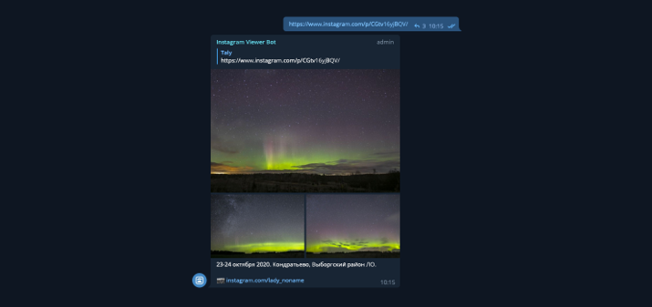

# Instagram Viewer Bot

Telegram bot for fetching Instagram posts.

Add [@imagram_bot](t.me/imagram_bot) to your group chat to enable links preloading.



## How to run

Copy `example.env` file to `.env` and fill the gaps.

Then run a container.

```
docker-compose up -d
```

<!--

## Example links for tests

1 image
https://www.instagram.com/p/CIMDRa-hpeW/

1 video
https://www.instagram.com/reel/CIIWGdqHRXt/

2 images 
https://www.instagram.com/p/CH05mMfBh8r/

3 images + 1 video
https://www.instagram.com/p/CIKrjTLDMiX/

10 images
https://www.instagram.com/p/CILRFXonT5J/

1 GIF (muted video?)
https://www.instagram.com/p/CIGZMPlA-HQ/
